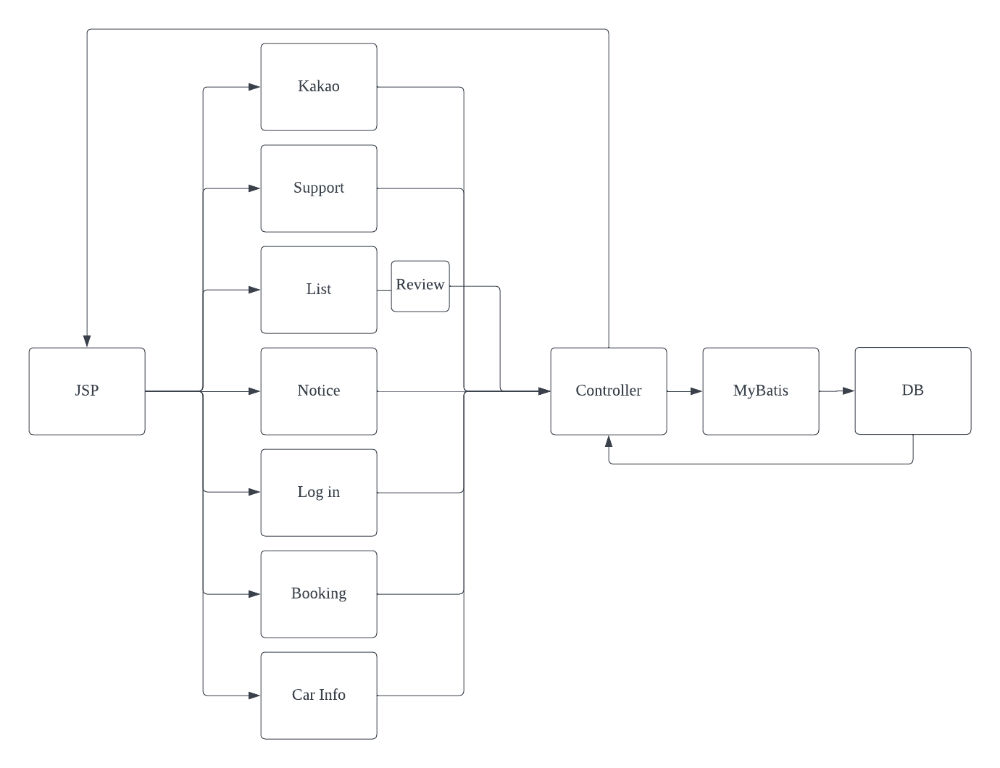
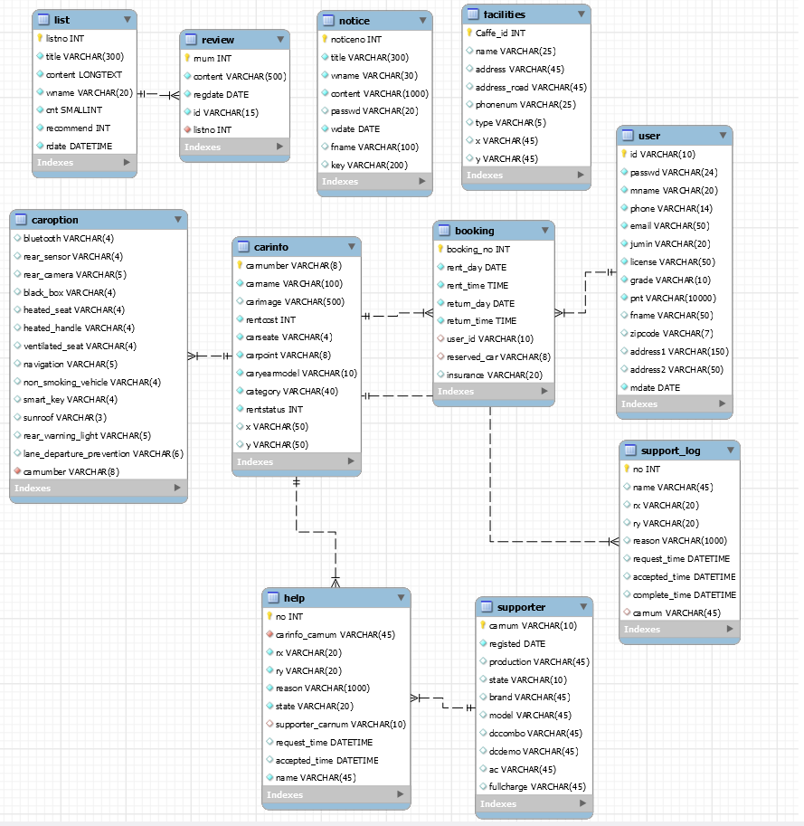

# EV RENT CAR team project

## Intro

- 환경을 생각하는 고객을 위한 전기차 전문 렌트 서비스 입니다.
- 전기차 충전소 위치 및 주변 편의시설 정보도 한번에 제공해주는 서비스 입니다.

## Tech Stack

- **Spring boot**
- **Gradle**
- **MyBatis**
- **Fetch API**
- **jQuery**
- **mySQL**

## API

**`/user` 유저 권한**
**`/admin` 관리자 권한**

> **Booking**

- 차량예약 `POST /user/booking/create`
- 예약차량 상세조회 `GET /user/booking/detail/{carnumber}`
- 차종 검색  `GET /user/booking/search/{category}`
- 예약가능 차량 조회 `GET /user/booking/searchList/{category}`
- 전체 차량조회`GET /user/booking/list`
- 예약조회 `GET /user/booking/read/{user_id}`
- 예약 페이지 메인 `GET /user/booking/main`

>**CarInfo**

- 차량위치정보 조회 `GET /admin/carinfo/mapupdate/{carnumber}`
-  차량위치정보 저장`POST /carinfo/mapupdate`
- 차량옵션 수정 양식 `GET /admin/carinfo/optupdate/{carnumber}`
- 차량옵션 수정 `POST /admin/carinfo/optupdate/{carnumber}`
- 차량옵션 이미지 저장 양식`GET /admin/carinfo/updateFile/{carnumber}`
- 차량옵션 이미지 저장`POST /admin/carinfo/updateFile/{carnumber}`
- 차량정보 삭제 `GET /admin/carinfo/delete/{carnumber}`
- 차량정보 수정양식 `GET /carinfo/update`
- 차량정보 수정 `POST /admin/carinfo/update/{carnumber}`
- 차량정보 조회 `GET /user/carinfo/read/{carnumber}`
- 차량정보 등록 `POST /carinfo/create`
- 차량정보 등록 양식 `GET /carinfo/create`
- 차량정보 리스트 `GET /carinfo/list`

>**Kakao**

- Kakao map API 위치정보 조회 `GET /kakao_url/{lng}/{lat}`
- 편의시설 위치정보 조회 `GET /facilities/{lng}/{lat}`
- 편의시설 위치정보 저장 `POST /facilities/create`

> **List(자유게시판)**

- 글삭제 `POST /user/contents/list/delete`
- 글 수정양식 `GET /user/contents/list/update`
- 글 수정 `POST /user/contents/list/update`
- 글 목록 `POST /user/contents /list/{listno}`
- 글 조회 `GET /user/contents/list/read`
- 글 생성양식 `GET /user/contents/list/create`
- 글 생성 `POST /user/contents/list/create`
- 글 조회 `GET /user/contents/list`

> **Log in**

- 회원탈퇴 `POST /exception/user/delete`
-  회원탈퇴 양식`GET /exception/user/delete`
- 회원정보 `GET /exception/admin/user/read`
- 회원목록 `GET /exception/admin/user/list`
- 회원정보 수정 `POST /exception/user/update`
- 회원정보 수정 양식`GET/exception/user/update`
- 운전명허증 정보 조회 `GET /exception/lic`
- 비밀번호 찾기 `GET /exception/user/pwfind`
- 아이디 찾기 `GET /exception/user/idfind`
- 회원가입 `POST /exception/user/create`
- 회원가입 양식 `POST /exception/user/createForm`
- 이용약관 가져오기 `GET /exception/user/agree`
- 로그아웃 `GET /exception/user/logout`
- 로그인 `POST/exception/user/login`
- 로그인 양식 `GET /exception/user/login`
- 운전명허증 정보 등록 `POST /license`
- 비밀번호 찾기 `GET /user/pwfindex`
- 아이디 찾기 `GET /user/idfindex`
- 이메일주소 조회 `GET /user/emailcheck`
- 중복아이디 확인 `GET /user/idcheck`

>**Notice**

- Main화면 `GET /`
- 파일 다운로드 `GET /notice/fileDown`
- 파일 삭제 `POST /admin/notice/deletefile`
- 공지수정 양식 `GET /admin/notice/update`
- 공지수정 `POST /admin/notice/update`
- 공지삭제 `POST /admin/notice/delete`
- 공지삭제 양식 `GET /admin/notice/delete`
- 공지생성 양식`GET /admin/notice/create`
- 공지생성 `POST /admin/notice/create`
- 공지조회 `GET /notice/read`
- 공지목록 `GET /notice/list`

> **Review**

- 댓글 목록 `GET /review/list/{listno}/{sno}/{eno}`
- 댓글 목록 페이징 `GET /review/page`
- 댓글 작성 `POST /review/create`
- 댓글 조회 `GET /review/{rnum}`
- 댓글 수정 `PUT /review/{rnum}`
- 댓글삭제 `DELETE /review/{rnum}`
- 댓글 목록 `POST /list/{listno}`

> **Support**

- 지원서비스 요청양식 `GET /user/request/create`
- 지원 서비스차량 조회 `GET /user/request/supporter`
- 지원 서비스 요청  `POST /user/request/help`
- 지원요청 수락 `GET /user/request/help/accept`
- 지원요청 삭제 `GET /user/request/help/delete/{carnum}`
- 지원 요정 완료 `GET /user/request/help/complete/{carnum}`

## Service process
- API 호출 및 응답 과정입니다

- 관리자 권한 및 일반 유저 권한 확인 프로세스

## ERD

