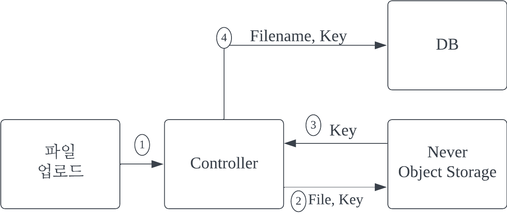

# EV RENT CAR team project

## Intro

- 환경을 생각하는 고객을 위한 전기차 전문 렌트 서비스 입니다.
- 전기차 렌트 뿐만아니라 전기차 충전소 위치 및 주변 편의시설 정보도 함께 제공합니다.
- 방전, 사고 등과 같은 위급사항 발생시 지원 서비스 역시 제공합니다.
- 해당 팀프로젝트에서 저는 **`공지사항` , `파일 업로드 / 다운로드` , `권한설정`** 을 담당했습니다.

## Tech Stack

- **Spring boot**
- **Gradle**
- **MyBatis**
- **Fetch API**
- **jQuery**
- **mySQL**

## Service process
- **EV Rent Car 프로젝트의 API 호출 및 응답 과정입니다**

- **권한 확인 프로세스**
  - 비회원, 회원, 관리자 별로 노출 및 사용하는 기능에 차별을 두었습니다.
  - 메인화면 접속시 현재 세션의 로그인 정보를 우선적으로 확인합니다.
  - 확인된 세션정보를 통해 노출되는 기능을 구분하였습니다.
  - 주소로 직접 접속을 방지하기 위해 Intercepter를 활용 하였습니다.

- 파일 업로드 / 다운로드 프로세스
  - Never Object Storage를 활용하였습니다.
  - Never Object Storage는 AwsS3를 모기술로 사용하는 웹 저장소입니다.
  - 재해복구, 관리의 편의성, 보안, 과부하 방지 등 다양한 장점을 가져오기위해 사용했습니다.

**< 파일 업로드 프로세스 >**

**< 파일 다운로드 프로세스 >**

## API

**`/user` 유저 권한**
**`/admin` 관리자 권한**

> **Booking**

- 차량예약 `POST /user/booking/create`
- 예약차량 상세조회 `GET /user/booking/detail/{carnumber}`
- 차종 검색  `GET /user/booking/search/{category}`
- 예약가능 차량 조회 `GET /user/booking/searchList/{category}`
- 전체 차량조회`GET /user/booking/list`
- 예약조회 `GET /user/booking/read/{user_id}`
- 예약 페이지 메인 `GET /user/booking/main`

>**CarInfo**

- 차량위치정보 조회 `GET /admin/carinfo/mapupdate/{carnumber}`
- 차량위치정보 저장`POST /carinfo/mapupdate`
- 차량옵션 수정 양식 `GET /admin/carinfo/optupdate/{carnumber}`
- 차량옵션 수정 `POST /admin/carinfo/optupdate/{carnumber}`
- 차량옵션 이미지 저장 양식`GET /admin/carinfo/updateFile/{carnumber}`
- 차량옵션 이미지 저장`POST /admin/carinfo/updateFile/{carnumber}`
- 차량정보 삭제 `GET /admin/carinfo/delete/{carnumber}`
- 차량정보 수정양식 `GET /carinfo/update`
- 차량정보 수정 `POST /admin/carinfo/update/{carnumber}`
- 차량정보 조회 `GET /user/carinfo/read/{carnumber}`
- 차량정보 등록 `POST /carinfo/create`
- 차량정보 등록 양식 `GET /carinfo/create`
- 차량정보 리스트 `GET /carinfo/list`

>**Kakao**

- Kakao map API 위치정보 조회 `GET /kakao_url/{lng}/{lat}`
- 편의시설 위치정보 조회 `GET /facilities/{lng}/{lat}`
- 편의시설 위치정보 저장 `POST /facilities/create`

> **List(자유게시판)**

- 글삭제 `POST /user/contents/list/delete`
- 글 수정양식 `GET /user/contents/list/update`
- 글 수정 `POST /user/contents/list/update`
- 글 목록 `POST /user/contents /list/{listno}`
- 글 조회 `GET /user/contents/list/read`
- 글 생성양식 `GET /user/contents/list/create`
- 글 생성 `POST /user/contents/list/create`
- 글 조회 `GET /user/contents/list`

> **Log in**

- 회원탈퇴 `POST /exception/user/delete`
- 회원탈퇴 양식`GET /exception/user/delete`
- 회원정보 `GET /exception/admin/user/read`
- 회원목록 `GET /exception/admin/user/list`
- 회원정보 수정 `POST /exception/user/update`
- 회원정보 수정 양식`GET/exception/user/update`
- 운전명허증 정보 조회 `GET /exception/lic`
- 비밀번호 찾기 `GET /exception/user/pwfind`
- 아이디 찾기 `GET /exception/user/idfind`
- 회원가입 `POST /exception/user/create`
- 회원가입 양식 `POST /exception/user/createForm`
- 이용약관 가져오기 `GET /exception/user/agree`
- 로그아웃 `GET /exception/user/logout`
- 로그인 `POST/exception/user/login`
- 로그인 양식 `GET /exception/user/login`
- 운전명허증 정보 등록 `POST /license`
- 비밀번호 찾기 `GET /user/pwfindex`
- 아이디 찾기 `GET /user/idfindex`
- 이메일주소 조회 `GET /user/emailcheck`
- 중복아이디 확인 `GET /user/idcheck`

>**Notice**

- Main화면 `GET /`
- 파일 다운로드 `GET /notice/fileDown`
- 파일 삭제 `POST /admin/notice/deletefile`
- 공지수정 양식 `GET /admin/notice/update`
- 공지수정 `POST /admin/notice/update`
- 공지삭제 `POST /admin/notice/delete`
- 공지삭제 양식 `GET /admin/notice/delete`
- 공지생성 양식`GET /admin/notice/create`
- 공지생성 `POST /admin/notice/create`
- 공지조회 `GET /notice/read`
- 공지목록 `GET /notice/list`

> **Review**

- 댓글 목록 `GET /review/list/{listno}/{sno}/{eno}`
- 댓글 목록 페이징 `GET /review/page`
- 댓글 작성 `POST /review/create`
- 댓글 조회 `GET /review/{rnum}`
- 댓글 수정 `PUT /review/{rnum}`
- 댓글삭제 `DELETE /review/{rnum}`
- 댓글 목록 `POST /list/{listno}`

> **Support**

- 지원서비스 요청양식 `GET /user/request/create`
- 지원 서비스차량 조회 `GET /user/request/supporter`
- 지원 서비스 요청  `POST /user/request/help`
- 지원요청 수락 `GET /user/request/help/accept`
- 지원요청 삭제 `GET /user/request/help/delete/{carnum}`
- 지원 요정 완료 `GET /user/request/help/complete/{carnum}`

## ERD

# Trouble Shooting

- 팀프로젝트를 수행하며 인상 깊었던 오류에 대한 기록입니다.

#### Never Object Storage로 변경하게 되어 발생한 오류

- **증상**
  - 파일에 대한 DB를 따로 생성하였으나 사용자 입장에서 보여줄 파일이름이 DB에 저장되지 않는 문제 발생
- **원인**
  - DB에 저장되는 이름이 Never Object Storage에서 저장됬을때 주는 key 값으로 저장되고 있었습니다.
- **접근 방법 및 해결과정**
  - 파일업로드에 대해 배우며 이름 및 용량정보를 함께 저장했던 경험을 토대로 이전 코드를 확인했습니다.
  - 구글검색을 활용하여 파일 이름만 따로 추출할 수 있는 도구를 찾았습니다.
  - `MultipartFile` 의 `getOriginalFilename()` 메서드를 활용하여 파일명을 추출했습니다.
  - key 값을 저장하는 새로운 컬럼을 추가했습니다.
- **결론**
  - 새로운 기술을 사용하며 발생하는 여러 문제에 대한 해결력을 높일 수 있었습니다.
  - 처음으로 배우지 않았던 기술에 대한 사용했던 경험으로 성장하는 개발자가 되기 위한 첫걸음이었습니다.
  - 프로젝트가 끝난후에는 아쉽게도 Never Object Storage는 만료가 되어 기능이 되지 않지만 모기술인 AWS s3에 대하여 학습했습니다.

#### 파일 업로드, 수정, 삭제 기능을 AJAX로 변경하며 발생한 오류

- **증상**
  - 파일 업로드, 수정, 삭제 요청시 error 메시지는 없으나 기능이 전혀 수행되지 않았습니다
- **원인**
  - 기존 동기통신에서는 문제가 없었으나 비동기통신으로 변경하게 되면 발생했습니다.
  - `fetch API` 에서 `formdata` 사용에 있어 `form` 태그와 함께 사용함으로 인해 생긴 오류였습니다.
- **접근 방법 및 해결과정**
  - 우선 오류가 나는 코드를 백업 후 이전코드로 롤백했습니다.
  - 로직을 변경해보며 문제가되는 부분을 찾았습니다.
  - MDN 사이트에서 fetch API에 대해 학습했습니다.
  - 비슷한 사례를 구글 검색해보았습니다.
  - `form` tag를 `div` 태그로 변경했습니다.
- **결론**
  - 비동기 통신과 같이 error 메시지 확인이 어려운 경우 발생하는 문제에 대한 해결역량을 높일 수 있었습니다.
  - 특히, error 처리에 있어 단순히 일어나는 현상에 대한 해결법검색보다는 바꿨던 부분부터 로직의 흐름을 타며 데이터 유무를 확인하는 것이 해결에 더 도움이 되는것을 느낄수 있었습니다.
  - 비동기 통신을 활용하여 자원소모는 줄이고 편의성을 높이는 개발에 대해 배울 수 있었습니다.
